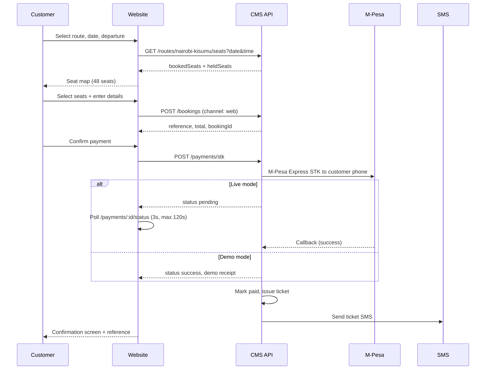
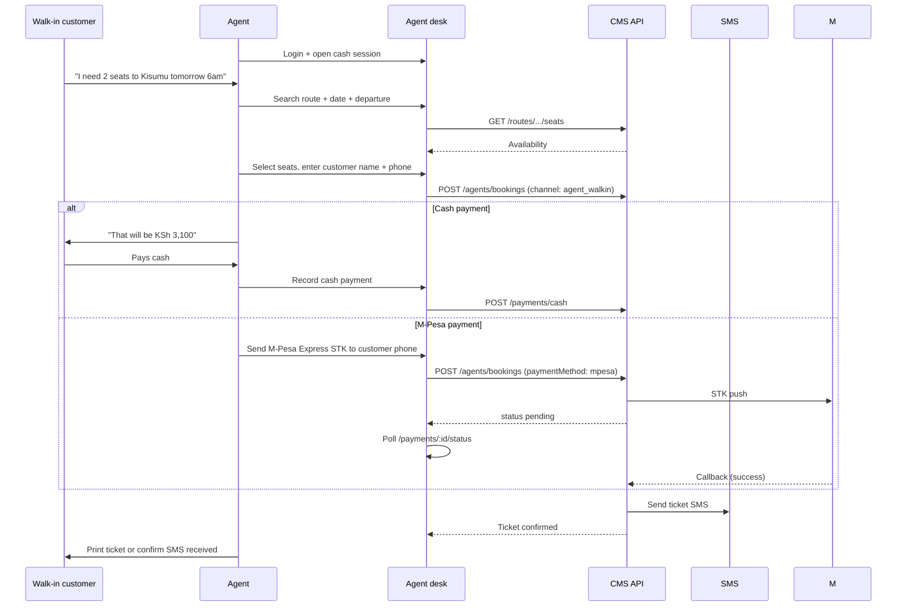

# Channels and workflows

Step-by-step user journeys for every channel in the Precifarm Ticketing & Payment CMS.

**Current-core channels:** Nairobi–Kisumu passenger website, mobile, and agent desk. Cargo workflows are expansion capability.

**Version:** 0.3 · 24 July 2026  
**Related:** [API reference](./API_REFERENCE.md) · [Payments & settlement](./PAYMENTS_AND_SETTLEMENT.md) · [Client channels](./CLIENT_CHANNELS.md)

---

## Table of contents

1. [Channel overview](#1-channel-overview)
2. [Website booking (public)](#2-website-booking-public)
3. [Native mobile app (passenger)](#3-native-mobile-app-passenger)
4. [Mobile PWA (passenger)](#4-mobile-pwa-passenger)
5. [Agent desk — walk-in](#5-agent-desk--walk-in)
6. [Agent desk — call-in](#6-agent-desk--call-in)
7. [Cargo booking (ET01)](#7-cargo-booking-et01)
8. [Operations — disruption](#8-operations--disruption)
9. [Operations — refund](#9-operations--refund)
10. [Ticket delivery](#10-ticket-delivery)

---

## 1. Channel overview

| Channel | Code | User | Payment methods | Phase | Status |
|---|---|---|---|---|---|
| Public website | `web` | Passenger | M-Pesa Express STK | A | ✅ CMS proxy + STK poll |
| Native mobile app | `mobile` / `pwa` | Passenger, cargo | M-Pesa Express STK | A | ✅ Direct CMS API (bus + cargo) |
| Mobile PWA | `pwa` | Passenger | M-Pesa STK | B | Planned |
| Agent walk-in | `agent_walkin` | Sales agent → customer | Cash, M-Pesa Express STK | A | ✅ Live STK on Quick Book |
| Agent call-in | `agent_callin` | Sales agent → customer | Cash, M-Pesa STK | A | ✅ |
| Cargo (all) | varies | Cargo customer | M-Pesa, cash at desk | A | ✅ CMS + mobile wired |

All channels share the **same seat/cargo inventory pool** per trip. No channel gets reserved capacity unless configured by ops (future feature).

---

## 2. Website booking (public)

**Source:** `kenya-ebus-ecosystem/website` → `BookingPortal` component  
**Backend:** CMS proxy when `CMS_API_URL` is set; in-memory demo fallback otherwise

### Flow



### Steps (matches current website demo)

| Step | UI | API | Notes |
|---|---|---|---|
| 1. Search | Route (fixed: Nairobi–Kisumu), date chips + picker, departure select | `GET /routes` | Single route in Phase A |
| 2. Seats | Interactive seat map + progress bar | `GET .../seats` | 12×4 layout; green/grey/red |
| 3. Details | Name, phone, **National ID**, email (optional) | — | ID required for boarding |
| 4. Pay | M-Pesa Express button | `POST /bookings` then `POST /payments/stk` | Live: poll until paid; demo: instant `DEMO…` receipt |
| 5. Confirm | Reference + receipt | Poll or immediate success | Retry / check status on paying step |

### Business rules

- 1–6 passengers per booking
- Date cannot be in the past (EAT timezone)
- Seat count must equal passenger count
- 10-minute hold during checkout (Redis TTL)
- Fare: KSh 1,550 × passengers

---

## 3. Native mobile app (passenger)

**Repo:** `Precifarm Mobile App` (Expo SDK 57)  
**Status:** Phase A — bus + **cargo** booking + track wired to CMS.

Same passenger flow as website: search → results → seat map → details (incl. National ID) → M-Pesa Express STK → poll → confirmation.

| Difference from website | Detail |
|---|---|
| API access | Direct to CMS (`EXPO_PUBLIC_API_URL`) — no website proxy |
| Channel code | `mobile` (recommended) or `pwa` |
| Payment UX | `useMpesaPaymentPoll` (3s / 120s); Retry + “I've paid” buttons |
| Payment mode | `useCmsPaymentMode` reads `GET /v1/health` |
| Cargo | `POST /v1/cargo/bookings` — sender/receiver ID, optional last mile |
| Mock fallback | `EXPO_PUBLIC_USE_MOCK=true` for offline UI dev |

See [Client channels](./CLIENT_CHANNELS.md) and [mobile CMS integration](../../Precifarm%20Mobile%20App/docs/CMS_INTEGRATION.md).

---

## 4. Mobile PWA (passenger)

**Phase B** — browser-based PWA; same flow as website, optimised for mobile.

### Additional features (Phase B)

| Feature | Description |
|---|---|
| Ticket wallet | List of upcoming and past tickets |
| Home screen install | Add to home screen prompt |
| Push notifications | Departure reminders, delay alerts (after SMS proof) |
| Offline ticket view | Cached QR/ticket for boarding without connectivity |
| Phone OTP login | Optional account linked to phone number |

### Flow differences from website

- Default channel: `pwa`
- Persistent customer session by phone
- Ticket wallet reads `GET /bookings?phone=` (authenticated)

---

## 5. Agent desk — walk-in

**Phase A priority** — sales staff at terminal/office.

### Prerequisites

1. Agent logs in (`POST /auth/login`)
2. Agent opens cash session (`POST /agents/cash-sessions/open`) with opening float

### Flow



### Agent desk UI screens (built)

| Screen | Purpose |
|---|---|
| **Dashboard** | Today's departures, open session, quick stats |
| **Quick book** | Route + date + time → seat map → customer form → cash or **M-Pesa Express STK** |
| **Cargo book** | Waybill + IDs + optional last mile → M-Pesa or cash |
| **Delivery** | Advance cargo delivery stages + SMS |
| **Last mile** | Assign riders, dispatch LMD shipments |
| **Lookup** | Search by reference; refund |
| **Cash session** | Open/close register, reconciliation |

### Target: complete walk-in booking in under 3 minutes

---

## 6. Agent desk — call-in

Same as walk-in with these differences:

| Aspect | Walk-in | Call-in |
|---|---|---|
| Channel | `agent_walkin` | `agent_callin` |
| Payment | Usually cash at counter | Usually M-Pesa STK to customer's phone |
| Seat hold | Immediate selection | Optional 10-min hold while customer decides |
| Ticket delivery | Print + SMS | SMS only (customer not present) |

### Call-in hold workflow

1. Customer calls: "Are there seats on the 6am to Kisumu tomorrow?"
2. Agent checks availability
3. Customer: "Let me confirm with my wife, call you back in 5 minutes"
4. Agent holds seats: `POST /trips/:tripId/seats/hold` (10 min TTL)
5. Customer calls back → agent completes booking before hold expires
6. If hold expires → seats return to available pool

---

## 7. Cargo booking (ET01)

**Phase A** — electric cargo van on the Nairobi–Kisumu route. Built in CMS agent desk and **Precifarm Mobile App**.

### Pricing & capacity

| Field | Value |
|---|---|
| Capacity | 500 kg per departure |
| Pricing | KSh 50/kg (rounded up) |
| Last mile | Optional + KSh 500 + delivery address |
| Waybill reference | `PF-CXXXXX` |
| Required IDs | Sender + receiver National ID / passport |

### Cargo booking flow

1. Select route + date + departure time
2. Enter sender/receiver (name, phone, ID), weight, description
3. Optional: last mile delivery + address
4. Pay: M-Pesa Express STK or cash at agent desk
5. Issue waybill; delivery tracking starts at `confirmed`
6. Ops advance stages on **Delivery** / **Last Mile** desks

### Delivery stages (paid cargo)

```
confirmed → received → loaded → in_transit → arrived → [out_for_delivery if LMD] → delivered
```

SMS to sender and receiver at each stage (logged to `data/sms.log` until live provider).

See [API reference](./API_REFERENCE.md) §5–§6 and ops endpoints in §9.

---

## 8. Operations — disruption

When a trip is delayed, cancelled, or needs a substitute vehicle.

### Delay

1. Ops marks trip `delayed` with new departure time + reason
2. System SMS all paid passengers on that trip
3. Passengers can rebook (free) or request refund

### Cancel

1. Ops marks trip `cancelled`
2. System auto-initiates refunds for all paid bookings
3. SMS all affected customers with refund notice

### Substitute vehicle

1. Ops logs substitute vehicle details
2. SMS passengers: same reference, new boarding point if changed
3. Ticket remains valid

**API:** `POST /ops/trips/:tripId/disrupt`

---

## 9. Operations — refund

### Triggers

- Customer request (via agent or ops)
- Trip cancellation (automatic)
- Payment error (pay OK / ticket fail — auto reverse)

### Flow

1. Ops/agent finds booking by reference
2. Verify payment status and ticket status
3. Initiate refund: `POST /ops/bookings/:id/refund`
4. System:
   - Sets booking status → `refunded`
   - Sets ticket status → `refunded`
   - Releases seats back to available
   - Records M-Pesa reversal (manual in Phase A; automated Phase B)
   - SMS customer confirmation
   - Audit log entry

### Cash refund

- Agent refunds cash from drawer
- Ops records manual cash refund against cash session
- Discrepancy noted in reconciliation

---

## 10. Ticket delivery

### SMS template (Phase A)

```
Precifarm: Your ticket PF-K7M2NP is confirmed.
Nairobi → Kisumu
20 Jul 2026, 06:00
Seats: 7B, 7C
Fare: KSh 3,100
Show this SMS at boarding.
Questions: +254 794 702 768
```

### Cargo waybill SMS (Phase B)

```
Precifarm Cargo: Waybill PF-C8N3QR confirmed.
Nairobi → Kisumu, 20 Jul 2026
Weight: 25kg
Receiver: John Okello 0712...
Track: precifarm.com/cargo/PF-C8N3QR
```

### Delivery channels by phase

| Channel | Phase A | Phase B |
|---|---|---|
| SMS | Yes | Yes |
| Email | No | Optional |
| WhatsApp | No | Yes |
| Print (agent) | Yes | Yes |
| QR code (PWA) | No | Yes |
| Push notification | No | Yes |

### Resend

Agent or ops can resend via `POST /agents/tickets/:reference/resend-sms`. Rate limited to 3 resends per ticket.
