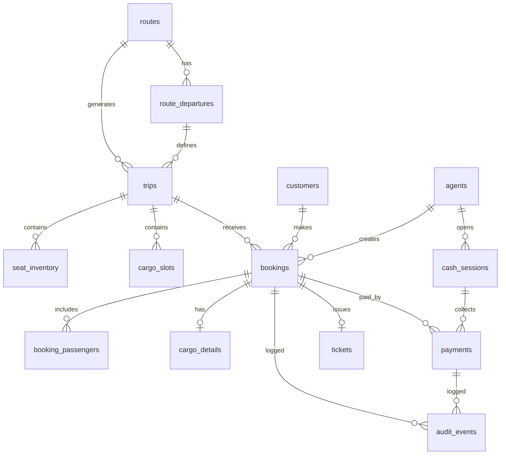

# Data model

PostgreSQL schema for the Precifarm Ticketing & Payment CMS.

**Version:** 0.1 · 16 July 2026  
**Related:** [Project specification](./PROJECT_SPECIFICATION.md) · [API reference](./API_REFERENCE.md)

---

## Table of contents

1. [Overview](#1-overview)
2. [Entity relationship diagram](#2-entity-relationship-diagram)
3. [Tables](#3-tables)
4. [Enums](#4-enums)
5. [Indexes and constraints](#5-indexes-and-constraints)
6. [Redis keys](#6-redis-keys)
7. [Seed data](#7-seed-data)
8. [Migration strategy](#8-migration-strategy)

---

## 1. Overview

### Design principles

- **Trip-centric:** A `trip` is a specific route + date + departure time. All seat/cargo inventory is scoped to a trip.
- **Channel-aware:** Every booking records how it was created (`web`, `pwa`, `agent_walkin`, `agent_callin`).
- **Audit everything:** State changes on bookings and payments append to `audit_events`.
- **Idempotent payments:** M-Pesa callbacks keyed by `CheckoutRequestID` / `MpesaReceiptNumber`.
- **Phone as customer key:** Kenyan phone number is the primary customer identifier for walk-in/call-in.

### Ported from website demo

These concepts map directly from `kenya-ebus-ecosystem/website/lib/`:

| Website concept | CMS entity |
|---|---|
| `nairobiKisumuRoute` | `routes` + `route_departures` |
| `Booking` type | `bookings` + `booking_passengers` |
| `seatTripKey(routeId, date, time)` | `trips` (unique composite) |
| `SEAT_ROWS × SEAT_LETTERS` | `seat_inventory` per trip |
| `generateBookingReference()` | `bookings.reference` (`PF-XXXXXX`) |
| `normalizeKenyanPhone()` | `customers.phone_e164` |

---

## 2. Entity relationship diagram



---

## 3. Tables

### 3.1 `routes`

Intercity routes on the Precifarm network.

| Column | Type | Constraints | Description |
|---|---|---|---|
| `id` | `varchar(64)` | PK | e.g. `nairobi-kisumu` |
| `label` | `varchar(128)` | NOT NULL | e.g. `Nairobi – Kisumu` |
| `origin` | `varchar(64)` | NOT NULL | e.g. `Nairobi` |
| `destination` | `varchar(64)` | NOT NULL | e.g. `Kisumu` |
| `distance_km` | `integer` | | ~345 |
| `duration_minutes` | `integer` | | ~285 (4h 45m) |
| `vehicle_model` | `varchar(64)` | NOT NULL | e.g. `Yutong U18` |
| `fare_per_seat` | `integer` | NOT NULL | KSh, e.g. 1550 |
| `status` | `route_status` | NOT NULL | `current`, `planned`, `inactive` |
| `created_at` | `timestamptz` | NOT NULL | |
| `updated_at` | `timestamptz` | NOT NULL | |

### 3.2 `route_departures`

Scheduled departure times for a route.

| Column | Type | Constraints | Description |
|---|---|---|---|
| `id` | `uuid` | PK | |
| `route_id` | `varchar(64)` | FK → routes | |
| `departure_time` | `time` | NOT NULL | e.g. `06:00` |
| `is_active` | `boolean` | DEFAULT true | |
| `created_at` | `timestamptz` | NOT NULL | |

**Unique:** `(route_id, departure_time)`

### 3.3 `trips`

A concrete departure instance: route + calendar date + time.

| Column | Type | Constraints | Description |
|---|---|---|---|
| `id` | `uuid` | PK | |
| `route_id` | `varchar(64)` | FK → routes | |
| `travel_date` | `date` | NOT NULL | |
| `departure_time` | `time` | NOT NULL | |
| `vehicle_model` | `varchar(64)` | NOT NULL | Snapshot from route |
| `seat_capacity` | `integer` | NOT NULL | Default 48 |
| `cargo_capacity_kg` | `integer` | | ET01 capacity (Phase B) |
| `status` | `trip_status` | NOT NULL | `scheduled`, `boarding`, `departed`, `cancelled`, `delayed` |
| `created_at` | `timestamptz` | NOT NULL | |
| `updated_at` | `timestamptz` | NOT NULL | |

**Unique:** `(route_id, travel_date, departure_time)`

Trips are auto-created on first booking query or pre-generated by a scheduler.

### 3.4 `seat_inventory`

Per-trip seat state. 48 rows per trip (1A–12D).

| Column | Type | Constraints | Description |
|---|---|---|---|
| `id` | `uuid` | PK | |
| `trip_id` | `uuid` | FK → trips | |
| `seat_id` | `varchar(4)` | NOT NULL | e.g. `7B` |
| `status` | `seat_status` | NOT NULL | `available`, `held`, `booked` |
| `hold_expires_at` | `timestamptz` | | Set when `held` |
| `booking_id` | `uuid` | FK → bookings, nullable | Set when `booked` |
| `updated_at` | `timestamptz` | NOT NULL | |

**Unique:** `(trip_id, seat_id)`

### 3.5 `customers`

| Column | Type | Constraints | Description |
|---|---|---|---|
| `id` | `uuid` | PK | |
| `phone_e164` | `varchar(16)` | UNIQUE, NOT NULL | e.g. `254712345678` |
| `name` | `varchar(128)` | | Latest known name |
| `email` | `varchar(256)` | | Optional |
| `created_at` | `timestamptz` | NOT NULL | |
| `updated_at` | `timestamptz` | NOT NULL | |

Phone normalization follows website `normalizeKenyanPhone()` rules.

### 3.6 `agents`

Sales desk staff.

| Column | Type | Constraints | Description |
|---|---|---|---|
| `id` | `uuid` | PK | |
| `email` | `varchar(256)` | UNIQUE, NOT NULL | |
| `password_hash` | `varchar(256)` | NOT NULL | bcrypt |
| `name` | `varchar(128)` | NOT NULL | |
| `role` | `agent_role` | NOT NULL | `agent`, `ops`, `admin` |
| `branch` | `varchar(64)` | | e.g. `Nairobi` |
| `is_active` | `boolean` | DEFAULT true | |
| `created_at` | `timestamptz` | NOT NULL | |
| `updated_at` | `timestamptz` | NOT NULL | |

### 3.7 `cash_sessions`

Agent cash drawer sessions for walk-in reconciliation.

| Column | Type | Constraints | Description |
|---|---|---|---|
| `id` | `uuid` | PK | |
| `agent_id` | `uuid` | FK → agents | |
| `opened_at` | `timestamptz` | NOT NULL | |
| `closed_at` | `timestamptz` | | |
| `opening_float` | `integer` | NOT NULL | KSh |
| `cash_collected` | `integer` | DEFAULT 0 | KSh, running total |
| `expected_cash` | `integer` | | Computed on close |
| `actual_cash` | `integer` | | Entered on close |
| `discrepancy` | `integer` | | `actual - expected` |
| `status` | `session_status` | NOT NULL | `open`, `closed` |
| `notes` | `text` | | |

### 3.8 `bookings`

Core booking record — passenger or cargo.

| Column | Type | Constraints | Description |
|---|---|---|---|
| `id` | `uuid` | PK | |
| `reference` | `varchar(16)` | UNIQUE, NOT NULL | `PF-XXXXXX` |
| `trip_id` | `uuid` | FK → trips | |
| `customer_id` | `uuid` | FK → customers | |
| `agent_id` | `uuid` | FK → agents, nullable | Set for desk bookings |
| `booking_type` | `booking_type` | NOT NULL | `passenger`, `cargo` |
| `channel` | `booking_channel` | NOT NULL | See enums |
| `passenger_count` | `integer` | | For passenger bookings |
| `seats` | `varchar(4)[]` | | e.g. `{7B,7C}` |
| `fare_per_unit` | `integer` | NOT NULL | KSh per seat or per kg |
| `total_amount` | `integer` | NOT NULL | KSh |
| `status` | `booking_status` | NOT NULL | See enums |
| `contact_name` | `varchar(128)` | NOT NULL | |
| `contact_phone` | `varchar(16)` | NOT NULL | E.164 |
| `contact_email` | `varchar(256)` | | |
| `notes` | `text` | | Agent notes |
| `paid_at` | `timestamptz` | | |
| `cancelled_at` | `timestamptz` | | |
| `created_at` | `timestamptz` | NOT NULL | |
| `updated_at` | `timestamptz` | NOT NULL | |

**Indexes:** `(trip_id)`, `(reference)`, `(customer_id)`, `(status)`, `(created_at)`

### 3.9 `booking_passengers`

Named passengers per seat (optional detail beyond count).

| Column | Type | Constraints | Description |
|---|---|---|---|
| `id` | `uuid` | PK | |
| `booking_id` | `uuid` | FK → bookings | |
| `seat_id` | `varchar(4)` | NOT NULL | |
| `name` | `varchar(128)` | NOT NULL | |
| `id_number` | `varchar(32)` | | Optional national ID |

### 3.10 `cargo_details`

Cargo-specific fields (Phase B; schema defined now).

| Column | Type | Constraints | Description |
|---|---|---|---|
| `id` | `uuid` | PK | |
| `booking_id` | `uuid` | FK → bookings, UNIQUE | |
| `weight_kg` | `decimal(8,2)` | NOT NULL | |
| `description` | `text` | NOT NULL | |
| `sender_name` | `varchar(128)` | NOT NULL | |
| `sender_phone` | `varchar(16)` | NOT NULL | |
| `receiver_name` | `varchar(128)` | NOT NULL | |
| `receiver_phone` | `varchar(16)` | NOT NULL | |
| `is_fragile` | `boolean` | DEFAULT false | |

### 3.11 `payments`

| Column | Type | Constraints | Description |
|---|---|---|---|
| `id` | `uuid` | PK | |
| `booking_id` | `uuid` | FK → bookings | |
| `method` | `payment_method` | NOT NULL | `mpesa`, `cash`, `card`, `invoice` |
| `amount` | `integer` | NOT NULL | KSh |
| `status` | `payment_status` | NOT NULL | `pending`, `completed`, `failed`, `reversed` |
| `idempotency_key` | `varchar(64)` | UNIQUE | Prevent duplicate processing |
| `mpesa_checkout_id` | `varchar(64)` | | Daraja CheckoutRequestID |
| `mpesa_receipt` | `varchar(32)` | | e.g. `QAB1CD2EFG` |
| `mpesa_phone` | `varchar(16)` | | Phone STK was sent to |
| `cash_session_id` | `uuid` | FK → cash_sessions, nullable | |
| `is_demo` | `boolean` | DEFAULT false | Demo payment flag |
| `failure_reason` | `text` | | |
| `completed_at` | `timestamptz` | | |
| `created_at` | `timestamptz` | NOT NULL | |
| `updated_at` | `timestamptz` | NOT NULL | |

### 3.12 `tickets`

| Column | Type | Constraints | Description |
|---|---|---|---|
| `id` | `uuid` | PK | |
| `booking_id` | `uuid` | FK → bookings, UNIQUE | |
| `ticket_code` | `varchar(16)` | UNIQUE, NOT NULL | Same as booking reference |
| `qr_payload` | `text` | | Encoded QR data |
| `status` | `ticket_status` | NOT NULL | `valid`, `used`, `cancelled`, `refunded` |
| `sms_sent_at` | `timestamptz` | | |
| `sms_delivery_status` | `varchar(32)` | | Provider status |
| `used_at` | `timestamptz` | | Boarding scan time |
| `created_at` | `timestamptz` | NOT NULL | |

### 3.13 `audit_events`

Append-only log for compliance and debugging.

| Column | Type | Constraints | Description |
|---|---|---|---|
| `id` | `uuid` | PK | |
| `entity_type` | `varchar(32)` | NOT NULL | `booking`, `payment`, `ticket`, `trip` |
| `entity_id` | `uuid` | NOT NULL | |
| `action` | `varchar(64)` | NOT NULL | e.g. `created`, `paid`, `cancelled`, `refunded` |
| `actor_type` | `varchar(16)` | NOT NULL | `customer`, `agent`, `system`, `webhook` |
| `actor_id` | `uuid` | | |
| `payload` | `jsonb` | | Before/after snapshot |
| `created_at` | `timestamptz` | NOT NULL | |

**Index:** `(entity_type, entity_id)`, `(created_at)`

### 3.14 `sms_messages`

Outbound SMS log.

| Column | Type | Constraints | Description |
|---|---|---|---|
| `id` | `uuid` | PK | |
| `booking_id` | `uuid` | FK → bookings, nullable | |
| `phone_e164` | `varchar(16)` | NOT NULL | |
| `body` | `text` | NOT NULL | |
| `provider` | `varchar(32)` | NOT NULL | e.g. `africastalking` |
| `provider_message_id` | `varchar(64)` | | |
| `status` | `varchar(32)` | NOT NULL | `queued`, `sent`, `delivered`, `failed` |
| `created_at` | `timestamptz` | NOT NULL | |

---

## 4. Enums

```sql
CREATE TYPE route_status AS ENUM ('current', 'planned', 'inactive');
CREATE TYPE trip_status AS ENUM ('scheduled', 'boarding', 'departed', 'cancelled', 'delayed');
CREATE TYPE seat_status AS ENUM ('available', 'held', 'booked');
CREATE TYPE booking_type AS ENUM ('passenger', 'cargo');
CREATE TYPE booking_channel AS ENUM ('web', 'pwa', 'agent_walkin', 'agent_callin');
CREATE TYPE booking_status AS ENUM ('pending', 'paid', 'failed', 'cancelled', 'refunded');
CREATE TYPE payment_method AS ENUM ('mpesa', 'cash', 'card', 'invoice');
CREATE TYPE payment_status AS ENUM ('pending', 'completed', 'failed', 'reversed');
CREATE TYPE ticket_status AS ENUM ('valid', 'used', 'cancelled', 'refunded');
CREATE TYPE agent_role AS ENUM ('agent', 'ops', 'admin');
CREATE TYPE session_status AS ENUM ('open', 'closed');
```

### Status lifecycles

**Booking:**

```
pending ──pay──► paid
   │                │
   │                ├──refund──► refunded
   │                └──cancel──► cancelled
   ├──fail──► failed
   └──timeout──► cancelled
```

**Payment:**

```
pending ──success──► completed
   │                     │
   └──fail──► failed     └──reverse──► reversed
```

---

## 5. Indexes and constraints

### Critical uniqueness

| Constraint | Purpose |
|---|---|
| `UNIQUE (route_id, travel_date, departure_time)` on `trips` | One trip per departure |
| `UNIQUE (trip_id, seat_id)` on `seat_inventory` | No duplicate seat rows |
| `UNIQUE (bookings.reference)` | Unique ticket references |
| `UNIQUE (payments.idempotency_key)` | Idempotent M-Pesa |
| `UNIQUE (customers.phone_e164)` | One customer per phone |

### Performance indexes

```sql
CREATE INDEX idx_trips_route_date ON trips (route_id, travel_date);
CREATE INDEX idx_bookings_trip_status ON bookings (trip_id, status);
CREATE INDEX idx_bookings_created ON bookings (created_at DESC);
CREATE INDEX idx_payments_booking ON payments (booking_id);
CREATE INDEX idx_seat_inventory_trip_status ON seat_inventory (trip_id, status);
CREATE INDEX idx_audit_entity ON audit_events (entity_type, entity_id);
```

---

## 6. Redis keys

Seat holds use Redis for fast concurrent access; PostgreSQL is updated on hold confirm/book.

| Key pattern | Type | TTL | Purpose |
|---|---|---|---|
| `hold:{tripId}:{seatId}` | String (booking draft ID) | 600s (10 min) | Temporary seat hold |
| `holds:{tripId}` | Set (seat IDs) | 600s | All held seats for a trip |
| `trip:{tripId}:booked` | Set (seat IDs) | None | Cache of booked seats (invalidate on book) |

### Hold flow

1. Customer selects seats → Redis `SET hold:{tripId}:{seatId}` with 10-min TTL
2. On booking confirm → move to PostgreSQL `seat_inventory.status = 'booked'`, delete Redis hold
3. On TTL expiry → background job sets `seat_inventory.status = 'available'`
4. Availability check = PostgreSQL booked + Redis held

---

## 7. Seed data

Phase A seed (matches website demo):

```sql
-- Route
INSERT INTO routes (id, label, origin, destination, distance_km, duration_minutes,
                    vehicle_model, fare_per_seat, status)
VALUES ('nairobi-kisumu', 'Nairobi – Kisumu', 'Nairobi', 'Kisumu',
        345, 285, 'Yutong U18', 1550, 'current');

-- Departures
INSERT INTO route_departures (route_id, departure_time) VALUES
  ('nairobi-kisumu', '06:00'),
  ('nairobi-kisumu', '08:00'),
  ('nairobi-kisumu', '10:00'),
  ('nairobi-kisumu', '14:00'),
  ('nairobi-kisumu', '16:00');

-- Admin agent (password set via env on first deploy)
INSERT INTO agents (email, password_hash, name, role, branch)
VALUES ('admin@precifarm.com', '$2b$...', 'System Admin', 'admin', 'Nairobi');
```

Seat inventory is generated when a trip is first accessed: 48 rows (1A–12D) per trip.

---

## 8. Migration strategy

1. **Tool:** Drizzle Kit or Prisma Migrate
2. **Naming:** `YYYYMMDDHHMMSS_description.sql`
3. **Order:** enums → tables → indexes → seed
4. **Zero-downtime:** additive migrations only in production; no column drops without deprecation period
5. **Website migration:** deploy CMS + seed first; switch website from in-memory to CMS API; verify with test bookings

### Website `Booking` type mapping

| Website field | CMS table.column |
|---|---|
| `id` | `bookings.id` |
| `reference` | `bookings.reference` |
| `routeId` | `trips.route_id` (via join) |
| `date` | `trips.travel_date` |
| `time` | `trips.departure_time` |
| `seats` | `bookings.seats` |
| `passengers` | `bookings.passenger_count` |
| `farePerSeat` | `bookings.fare_per_unit` |
| `total` | `bookings.total_amount` |
| `name` | `bookings.contact_name` |
| `phone` | `bookings.contact_phone` |
| `status` | `bookings.status` |
| `mpesaReceipt` | `payments.mpesa_receipt` |
| `paidAt` | `bookings.paid_at` |
| `createdAt` | `bookings.created_at` |
