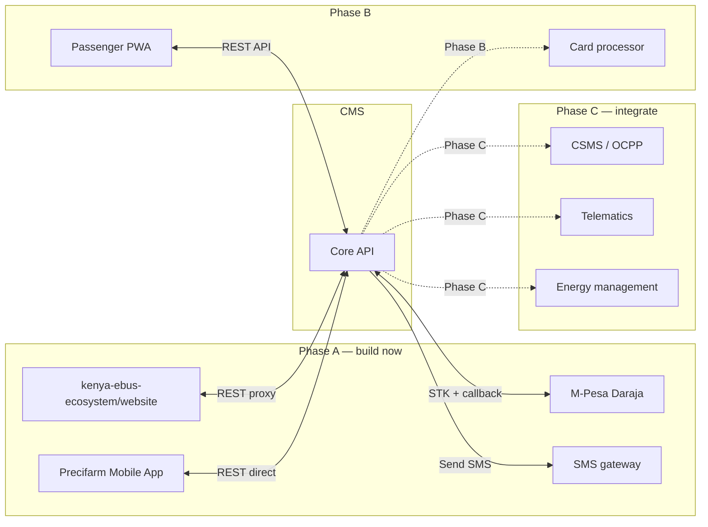

# Integrations

External system connections for the Precifarm Ticketing & Payment CMS.

**Version:** 0.2 · 24 July 2026  
**Related:** [API reference](./API_REFERENCE.md) · [Payments & settlement](./PAYMENTS_AND_SETTLEMENT.md) · [Client channels](./CLIENT_CHANNELS.md)

---

## Table of contents

1. [Integration map](#1-integration-map)
2. [Public website sync](#2-public-website-sync)
3. [M-Pesa Daraja](#3-m-pesa-daraja)
4. [SMS gateway](#4-sms-gateway)
5. [Future integrations](#5-future-integrations)
6. [Integration principles](#6-integration-principles)

---

## 1. Integration map



Master document guidance: **integrate commodity services; build the differentiating booking/ops layer.**

---

## 2. Public website sync

### Current state (July 2026)

Website (`kenya-ebus-ecosystem/website`) supports **dual mode**:

| Mode | When | Behaviour |
|---|---|---|
| **CMS proxy** | `CMS_API_URL` set (e.g. `http://localhost:3002/api`) | `/api/seats`, `/api/booking`, `/api/payment` forward to CMS via `lib/cms.ts` |
| **Standalone demo** | `CMS_API_URL` unset | In-memory store (`lib/booking-store.ts`) + local M-Pesa demo |

| Component | Location | CMS mode | Demo mode |
|---|---|---|---|
| Route data | `lib/route.ts` | Static (matches CMS Phase A) | Static |
| Seat layout | `lib/seats.ts` | Static | Static |
| Seat availability | `app/api/seats/route.ts` | Proxies `GET /v1/routes/:id/seats` | In-memory |
| Booking create | `app/api/booking/route.ts` | Proxies `POST /v1/bookings` (`channel: web`, `idNumber`) | In-memory |
| Payment | `app/api/payment/route.ts` | Proxies `POST /v1/payments/stk`; returns `pending` for live STK | Local `lib/mpesa.ts` |
| Payment status | `app/api/payment/status/route.ts` | Proxies `GET /v1/payments/:id/status` | N/A (CMS required) |
| CMS health | `app/api/cms/health/route.ts` | Proxies `GET /v1/health` (payment mode) | Returns `demo` when CMS unset |
| CMS client | `lib/cms.ts`, `lib/payment.ts` | `isCmsEnabled()`, `cmsFetch()` | — |

### Native mobile app

`Precifarm Mobile App` (Expo) calls the CMS API **directly** — no website proxy.

| Variable | Value |
|---|---|
| `EXPO_PUBLIC_API_URL` | `http://localhost:3002/api` (LAN IP on device) |
| `EXPO_PUBLIC_CHANNEL` | `mobile` (recommended) or `pwa` |
| `EXPO_PUBLIC_USE_MOCK` | `false` for live CMS |

| Flow | Status | CMS endpoints |
|---|---|---|
| Bus booking + M-Pesa Express STK | ✅ | `POST /bookings`, `/payments/stk`, poll `/payments/:id/status` |
| Cargo booking + STK | ✅ | `POST /cargo/bookings` |
| Track lookup | ✅ | `GET /bookings/:reference` |
| Payment mode indicator | ✅ | `GET /health` via `fetchCmsHealth()` |

Shared client constants: `lib/mpesa.ts` (poll 3s / timeout 120s).  
Docs: [Mobile CMS integration](../../Precifarm%20Mobile%20App/docs/CMS_INTEGRATION.md) · [Daraja setup](../../Precifarm%20Mobile%20App/docs/DARAJA_SETUP.md)

### Migration options (historical)

| Option | Pros | Cons |
|---|---|---|
| **A. Proxy** — website `/api/*` forwards to CMS | No frontend changes; CORS avoided | Extra hop; two APIs to maintain |
| **B. Direct** — frontend calls CMS API | Cleaner; single API | CORS config needed; env var for CMS URL |
| **C. Shared package** — monorepo with shared types | Type safety; DRY validation | Requires repo restructure |

**Implemented:** Option **A** (proxy) — website `/api/*` forwards to CMS when `CMS_API_URL` is set. In-memory demo remains as fallback when unset.

Option **B** (direct client → CMS) is used by the native mobile app today.

### Proxy example (implemented)

Website `app/api/seats/route.ts` when `isCmsEnabled()`:

```typescript
const occupied = await cmsGetSeats(routeId, date, time);
return NextResponse.json({ occupied });
```

See `lib/cms.ts` for `cmsCreateBooking`, `cmsStkPayment`, and error handling.

### Data sync for routes and fares

| Data | Source of truth | Website behaviour |
|---|---|---|
| Routes, departures, fares | CMS database | Fetch at build time (ISR) or runtime |
| Seat availability | CMS (live) | Always fetch at booking time |
| Bookings | CMS | Never stored locally |
| Hub/charging data | Website static (`lib/hub-locations.ts`) | Unchanged — not part of CMS |

### Environment variables (website side)

| Variable | Purpose |
|---|---|
| `CMS_API_URL` | CMS base URL including `/api` (e.g. `http://localhost:3002/api`) |
| `CMS_API_KEY` | Optional server-to-server auth key (not required for local dev) |

---

## 3. M-Pesa Daraja

See [Payments & settlement](./PAYMENTS_AND_SETTLEMENT.md) and [Mobile Daraja setup](../../Precifarm%20Mobile%20App/docs/DARAJA_SETUP.md).

### Harmonized architecture (July 2026)

| Channel | Config | STK |
|---|---|---|
| **CMS** | `.env` — all `MPESA_*`, `DEMO_PAYMENT`, `MPESA_TEST_PHONE` | Initiates Express STK + receives callback |
| **Mobile app** | `EXPO_PUBLIC_API_URL` only | `POST /v1/payments/stk` + poll `/v1/payments/:id/status` |
| **Website** | `CMS_API_URL` in `.env.local` | Proxies STK; polls `/api/payment/status` until paid |

**Do not duplicate `MPESA_*` on mobile or website when using the CMS.**

### Integration summary

| Aspect | Detail |
|---|---|
| Provider | Safaricom Daraja API |
| Methods | M-Pesa Express STK (Lipa na M-Pesa Online) |
| CMS code | `src/lib/mpesa.ts`, `src/lib/env.ts` |
| Health | `GET /api/v1/health` → `paymentMode` |
| Auth | OAuth client credentials |
| Callback | `POST /api/v1/payments/mpesa/callback` (public HTTPS in live mode) |
| Local tunnel | `npm run tunnel:mpesa` in CMS folder |
| Test | `npm run test:mpesa-auth` · `npm run test:stk` (CMS or mobile folder) |
| Environments | Sandbox + production |

### Port checklist

- [x] Move M-Pesa logic to CMS `src/lib/mpesa.ts`
- [x] Callback route with idempotency
- [x] Payment status polling (`GET /v1/payments/:bookingId/status`)
- [x] Website pending STK + poll when `CMS_API_URL` set
- [x] Mobile poll via `useMpesaPaymentPoll`
- [ ] Store all callback payloads in audit log (partial)

---

## 4. SMS gateway

### Requirements

- Deliver to Kenyan mobile numbers (Safaricom, Airtel, Telkom)
- Alphanumeric sender ID: `PRECIFARM`
- Delivery status callbacks
- Cost-effective for transactional SMS

### Provider candidates

| Provider | Notes |
|---|---|
| **AfricasTalking** | Kenya-native; good API; delivery reports |
| **Twilio** | Global; higher cost; reliable |
| **Advanta SMS** | Kenya-local; bulk pricing |

**Decision:** TBD (open decision #3 in project spec)

### Integration pattern

```typescript
// apps/api/src/services/sms.ts
async function sendTicketSms(booking: Booking, ticket: Ticket): Promise<SmsResult> {
  const body = formatTicketSms(booking, ticket);
  const result = await smsProvider.send({
    to: booking.contact_phone,
    from: process.env.SMS_SENDER_ID,
    body,
  });
  await db.insert(sms_messages).values({
    booking_id: booking.id,
    phone_e164: booking.contact_phone,
    body,
    provider: result.provider,
    provider_message_id: result.messageId,
    status: 'queued',
  });
  return result;
}
```

### SMS types

| Type | Trigger | Phase |
|---|---|---|
| Ticket confirmation | Payment completed | A |
| Departure reminder | 2 hours before departure | B |
| Delay notification | Trip disrupted | B |
| Refund confirmation | Refund processed | A |
| Cargo waybill | Cargo payment completed | B |

---

## 5. Future integrations

From master document §8 — integrate, do not build:

### CSMS / OCPP (Phase C)

- Monitor charger status at Precifarm hubs
- Correlate charge sessions with trip departures
- Alert ops if charger down before scheduled departure

### Telematics (Phase C)

- Vehicle SOC (state of charge) before departure
- Range shortfall alerts → substitute vehicle playbook
- Partner operator portal shows live vehicle status

### Energy management system (Phase C)

- BESS dispatch during grid outages
- Solar/storage cost optimisation for hub energy

### Card payments (Phase B)

- Paystack or Stripe for international cards
- 3D Secure; no raw card storage (PCI compliance)

### WhatsApp (Phase B)

- Ticket delivery via WhatsApp Business API
- Departure updates and disruption notifications

### Identity / KYC (Phase B)

- Phone OTP verification for PWA accounts
- Optional national ID for cargo waybills

---

## 6. Integration principles

From master document:

| Principle | Application |
|---|---|
| **Build thin, integrate commodity** | CMS builds booking/ops; M-Pesa/SMS/OCPP are integrations |
| **Open APIs + data export** | No vendor lock-in; all data exportable |
| **Unique IDs + timestamps** | Every integration event logged in `audit_events` |
| **Vendor data rights** | Procurement requires API access and export capability |
| **Offline limits** | Agent desk works with degraded connectivity; sync when restored |
| **No raw card storage** | Card payments via hosted checkout only |
| **Segmentation** | External services cannot access booking database directly |

### Error handling for external services

| Service down | Fallback |
|---|---|
| M-Pesa | Agent desk accepts cash; web shows "try again" |
| SMS | Ticket still issued; ops can resend manually; customer can look up by reference |
| CMS API (from website) | Website shows "booking temporarily unavailable" |
| Redis | Fall back to PostgreSQL-only seat locking (slower but safe) |

### Monitoring (Phase B)

- M-Pesa callback latency and failure rate
- SMS delivery rate
- API response times
- Payment reconciliation drift alerts
