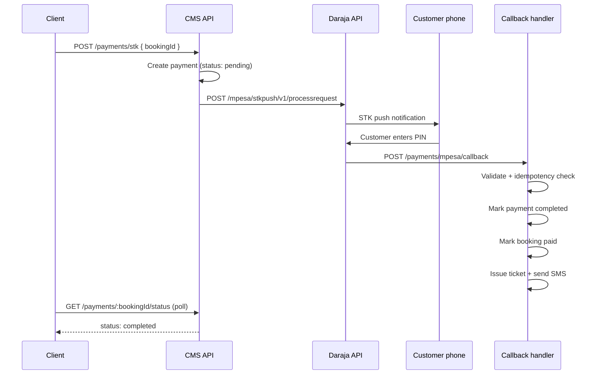
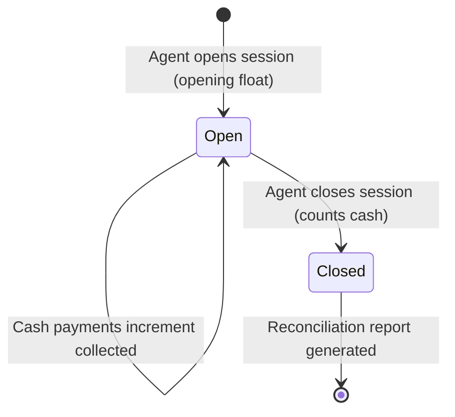

# Payments and settlement

Payment processing, reconciliation, and financial controls for the Precifarm CMS.

**Current core:** passenger M-Pesa/cash reconciliation and operator reporting. Cargo fleet invoicing is expansion capability, not current revenue.

**Version:** 0.2 · 24 July 2026  
**Related:** [API reference](./API_REFERENCE.md) · [Channels & workflows](./CHANNELS_AND_WORKFLOWS.md) · [Client channels](./CLIENT_CHANNELS.md)

---

## Table of contents

1. [Payment methods](#1-payment-methods)
2. [M-Pesa integration](#2-m-pesa-integration)
3. [Demo mode](#3-demo-mode)
4. [Cash payments](#4-cash-payments)
5. [Payment lifecycle](#5-payment-lifecycle)
6. [Idempotency](#6-idempotency)
7. [Edge case: pay OK / ticket fail](#7-edge-case-pay-ok--ticket-fail)
8. [Reconciliation](#8-reconciliation)
9. [Refunds and reversals](#9-refunds-and-reversals)
10. [Environment variables](#10-environment-variables)

---

## 1. Payment methods

| Method | Phase | Channels | Settlement |
|---|---|---|---|
| **M-Pesa STK** | A | Web, PWA, agent desk | Real-time via Daraja callback |
| **Cash** | A | Agent desk (walk-in) | End-of-shift reconciliation |
| **Card** | B | Web, PWA | Stripe/Paystack (TBD) |
| **Fleet invoice** | B | Cargo fleet accounts | Monthly billing cycle |

Phase A launches with **M-Pesa + cash only**, matching the master document mandate.

---

## 2. M-Pesa integration

Ports existing logic from `kenya-ebus-ecosystem/website/lib/mpesa.ts`.

### STK push flow



### Daraja API steps (live mode)

1. **OAuth token:** `GET /oauth/v1/generate?grant_type=client_credentials`
2. **STK push:** `POST /mpesa/stkpush/v1/processrequest`
   - `BusinessShortCode`: paybill/till number
   - `Password`: base64(shortcode + passkey + timestamp)
   - `PartyA` / `PhoneNumber`: customer phone (254...)
   - `Amount`: booking total
   - `AccountReference`: booking reference (`PF-XXXXXX`)
   - `TransactionDesc`: `Precifarm ticket PF-XXXXXX`
   - `CallBackURL`: CMS callback endpoint
3. **Callback:** Safaricom POSTs result to callback URL

### Callback payload handling

| ResultCode | Action |
|---|---|
| `0` | Success — store `MpesaReceiptNumber`, mark paid |
| Non-zero | Failure — mark payment failed, release seats |

Store full callback JSON in `audit_events` for dispute resolution.

---

## 3. Demo mode

Matches website behaviour: no real charge when demo is active.

### Activation

Demo mode is ON when **any** of:

- `DEMO_PAYMENT` is not set to `"false"`
- M-Pesa credentials are missing (`MPESA_CONSUMER_KEY`, etc.)

### Behaviour

- 2.5 second simulated delay (matches website)
- Generates receipt: `DEMO{timestamp}`
- Marks booking paid immediately
- Sets `payments.is_demo = true`
- Issues ticket and sends SMS normally
- Response includes `"demo": true` flag

### Production checklist

Before going live:

- [ ] Set all `MPESA_*` environment variables
- [ ] Set `DEMO_PAYMENT=false`
- [ ] Register callback URL with Safaricom
- [ ] Test STK push in sandbox
- [ ] Test callback handling
- [ ] Verify SMS delivery on successful payment

---

## 4. Cash payments

Agent desk only. Requires open cash session.

### Flow

1. Agent creates booking (`POST /agents/bookings`)
2. Customer pays cash at counter
3. Agent records: `POST /payments/cash { bookingId, amountReceived }`
4. System:
   - Validates amount matches booking total
   - Creates payment record (method: `cash`, status: `completed`)
   - Marks booking `paid`
   - Issues ticket + SMS
   - Increments `cash_sessions.cash_collected`
   - Generates receipt number: `CSH-YYYYMMDD-NNNN`

### Cash session lifecycle



### Close session

Agent enters actual cash count. System computes:

```
expected_cash = opening_float + cash_collected
discrepancy = actual_cash - expected_cash
```

Discrepancies flagged for ops review.

---

## 5. Payment lifecycle

```
                    ┌─────────────┐
                    │   pending   │
                    └──────┬──────┘
                           │
              ┌────────────┼────────────┐
              ▼                         ▼
       ┌─────────────┐          ┌─────────────┐
       │  completed  │          │   failed    │
       └──────┬──────┘          └─────────────┘
              │
              ▼
       ┌─────────────┐
       │  reversed   │
       └─────────────┘
```

| Status | Meaning |
|---|---|
| `pending` | STK sent, awaiting customer PIN or callback |
| `completed` | Payment confirmed (M-Pesa receipt or cash recorded) |
| `failed` | STK declined, timeout, or insufficient funds |
| `reversed` | Refund processed |

---

## 6. Idempotency

Critical for M-Pesa callbacks which may arrive more than once.

### Rules

1. Each payment has a unique `idempotency_key` (UUID, generated at STK initiation)
2. M-Pesa callback handler checks: if payment already `completed` with same receipt → return 200, no-op
3. Database unique constraint on `idempotency_key`
4. Booking status transition is atomic: `pending → paid` only once

### Implementation

```sql
-- Only one completed payment per booking
CREATE UNIQUE INDEX idx_one_completed_payment
  ON payments (booking_id)
  WHERE status = 'completed';
```

Callback handler pseudocode:

```
on callback(checkoutRequestId, resultCode, receipt):
  payment = find by mpesa_checkout_id
  
  if payment.status == 'completed':
    return 200  // already processed
  
  if resultCode == 0:
    transaction:
      payment.status = 'completed'
      payment.mpesa_receipt = receipt
      booking.status = 'paid'
      issue_ticket(booking)
      send_sms(booking)
      audit_log('payment.completed')
  else:
    payment.status = 'failed'
    release_seats(booking)
    audit_log('payment.failed')
```

---

## 7. Edge case: pay OK / ticket fail

From master document §10 — requires Phase A playbook.

### Scenario

M-Pesa deducts money but ticket issuance or SMS fails.

### Detection

- Payment marked `completed` but no ticket record exists
- Or ticket exists but `sms_sent_at` is null after 5 minutes

### Response (automated)

1. Background job detects orphaned completed payments
2. Retry ticket issuance (up to 3 attempts)
3. Retry SMS send (up to 3 attempts)
4. If still failing after 15 minutes → alert ops
5. Ops manually issues ticket or initiates M-Pesa reversal

### Prevention

- Ticket issuance inside the same database transaction as payment completion
- SMS send is async (queue) but ticket exists before SMS is attempted
- Customer can always look up ticket by reference on website/PWA

---

## 8. Reconciliation

### Daily reconciliation report

Generated at end of day (or on demand via ops portal).

**GET `/v1/ops/reconciliation?date=2026-07-16`**

| Section | Fields |
|---|---|
| **M-Pesa** | Total transactions, total amount, failed count, demo count |
| **Cash** | Sessions opened, total collected, discrepancies |
| **Bookings** | Created, paid, cancelled, refunded — by channel |
| **Tickets** | Issued, SMS sent, SMS failed |
| **Unmatched** | Completed payments without tickets; paid bookings without payments |

### Agent session report

Per agent, per session:

| Field | Value |
|---|---|
| Agent name | Jane Agent |
| Session | 08:00 – 17:00 |
| Opening float | KSh 5,000 |
| Cash bookings | 12 bookings, KSh 46,500 |
| Expected cash | KSh 51,500 |
| Actual cash | KSh 51,500 |
| Discrepancy | KSh 0 |

### M-Pesa vs Daraja reconciliation

Weekly (Phase B): compare CMS payment records against M-Pesa statement export.

---

## 9. Refunds and reversals

### M-Pesa reversal (Phase A: manual)

1. Ops initiates refund in CMS
2. CMS marks booking/ticket/payment as reversed/refunded
3. Ops manually processes B2C reversal via Daraja or M-Pesa portal
4. Ops records reversal receipt in CMS

### M-Pesa reversal (Phase B: automated)

- CMS calls Daraja reversal API
- Callback confirms reversal
- Full audit trail

### Cash refund

1. Agent refunds cash to customer
2. Agent records refund in CMS (deducts from cash session)
3. Booking/ticket marked refunded
4. Seats released

### Refund policy (TBD — requires service charter)

| Scenario | Refund |
|---|---|
| Customer cancels > 24h before departure | Full refund |
| Customer cancels < 24h before departure | Partial or credit (TBD) |
| Trip cancelled by Precifarm | Full auto-refund |
| No-show | No refund |

---

## 10. Environment variables

Ported from website README:

| Variable | Required | Default | Purpose |
|---|---|---|---|
| `DEMO_PAYMENT` | No | demo on | Set `"false"` for live M-Pesa |
| `MPESA_CONSUMER_KEY` | Live only | — | Daraja OAuth |
| `MPESA_CONSUMER_SECRET` | Live only | — | Daraja OAuth |
| `MPESA_PASSKEY` | Live only | — | STK push password |
| `MPESA_SHORTCODE` | Live only | — | Paybill/till number |
| `MPESA_CALLBACK_URL` | Live only | — | Must be publicly reachable HTTPS |
| `MPESA_ENVIRONMENT` | No | `sandbox` | `sandbox` or `production` |
| `MPESA_TEST_PHONE` | Test scripts | `254708374149` | Safaricom number for `npm run test:stk` |

### Harmonized testing (CMS + mobile + website)

All channels use **one CMS `.env`** for Daraja. Mobile and website only need their API URL.

| Step | Command / config |
|---|---|
| 1. OAuth check | `npm run test:mpesa-auth` (CMS folder) |
| 2. HTTPS tunnel (local live STK) | `npm run tunnel:mpesa` → set `MPESA_CALLBACK_URL` → restart CMS |
| 3. STK smoke test | `npm run test:stk` (CMS or mobile folder) |
| 4. Health | `GET /api/v1/health` → `paymentMode: live-sandbox` or `live-production` |
| 5. Mobile | `EXPO_PUBLIC_API_URL` + `EXPO_PUBLIC_USE_MOCK=false` — no `MPESA_*` |
| 6. Website | `CMS_API_URL=http://localhost:3002/api` in `.env.local` — no `MPESA_*` |

### Harmonized client flow (website + mobile + agent desk)

All channels use the same CMS endpoints and response shapes:

| Step | CMS endpoint | Response when live |
|---|---|---|
| 1. Create booking | `POST /v1/bookings` or `/v1/cargo/bookings` | `{ bookingId, reference, status: "pending" }` |
| 2. STK push | `POST /v1/payments/stk` | `{ status: "pending", message, checkoutRequestId }` or `{ status: "success", demo?, mpesaReceipt }` |
| 3. Poll | `GET /v1/payments/:bookingId/status` | `{ bookingStatus, paymentStatus, mpesaReceipt }` |

Shared client constants (poll every **3s**, timeout **120s**): `lib/mpesa.ts` (mobile) · `lib/payment.ts` (website).

| Channel | Config | STK UI |
|---|---|---|
| Website | `CMS_API_URL` in `.env.local` | Retry + check status on paying step |
| Mobile | `EXPO_PUBLIC_API_URL` | `useMpesaPaymentPoll` + retry/check buttons |
| Agent desk | CMS session | Quick Book pending screen + poll |

**Never duplicate `MPESA_*` on website or mobile** — Daraja credentials live in CMS `.env` only.

Additional CMS variables:

| Variable | Purpose |
|---|---|
| `DATABASE_URL` | PostgreSQL connection |
| `REDIS_URL` | Redis connection |
| `SMS_API_KEY` | AfricasTalking or equivalent |
| `SMS_SENDER_ID` | SMS sender name (e.g. `PRECIFARM`) |
| `JWT_SECRET` | Agent auth token signing |
| `API_KEY` | Website server-to-server auth |
