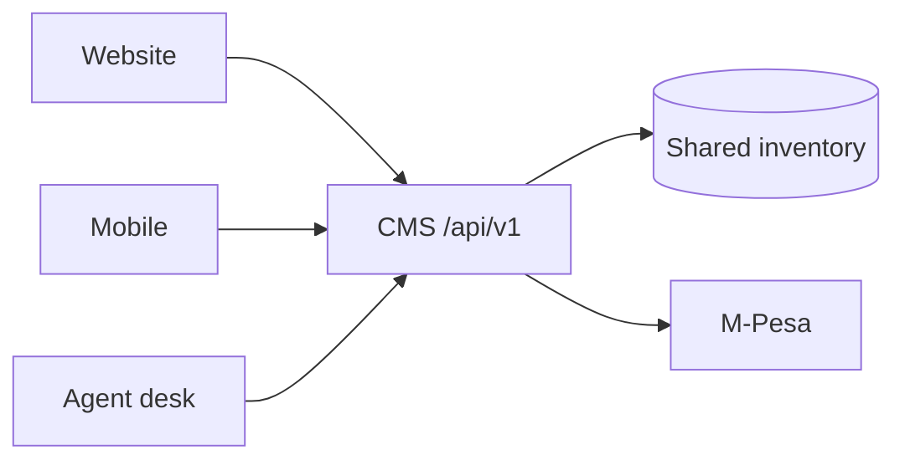

# Products and Channels

## Product responsibilities

| Product | CMS owns |
|---|---|
| Reserved Route Charging | Future charge-session ingestion and energy statement inputs |
| Digital Ticketing | Timetable, seat inventory, booking, payment, ticket, manifest |
| Settlement & Reporting | Transaction matching, refunds, cash sessions, operator statement, audit |

## Channel contract

Website, mobile, and desk must never maintain separate production booking state.

## Status

- Passenger booking API: **actual prototype**
- Agent desk: **actual prototype**
- M-Pesa hooks: **actual; live paid operation unproven**
- Operator settlement: **target**
- Charging integration: **target**

## Expansion boundary

Cargo and delivery modules remain in code. They are Stage 1 expansion capability under the [Gated Expansion Plan](../../kenya-ebus-ecosystem/docs/roadmap/expansion-plan.md).
