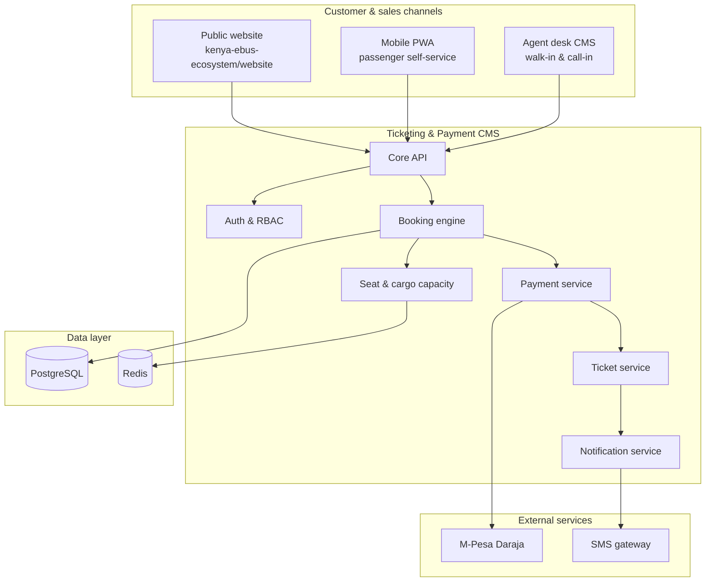

# Project specification

**Precifarm Ticketing & Payment CMS**  
Version 0.1 · 16 July 2026 · Planning document

> **Current-core override (24 July 2026):** the CMS currently serves Digital Ticketing and Settlement & Reporting for Nairobi–Kisumu passengers. Cargo sections below describe built or planned Stage 1 expansion capability, not current product, revenue, or traction. [`PRODUCTS_AND_CHANNELS.md`](./PRODUCTS_AND_CHANNELS.md) and the [business Canon](../../kenya-ebus-ecosystem/docs/CANON.md) govern current scope.

---

## Table of contents

1. [Executive summary](#1-executive-summary)
2. [Business context](#2-business-context)
3. [Problem statement](#3-problem-statement)
4. [System vision](#4-system-vision)
5. [Users and personas](#5-users-and-personas)
6. [Scope](#6-scope)
7. [Functional requirements](#7-functional-requirements)
8. [Non-functional requirements](#8-non-functional-requirements)
9. [System architecture](#9-system-architecture)
10. [Technology stack](#10-technology-stack)
11. [Repository structure (planned)](#11-repository-structure-planned)
12. [Implementation phases](#12-implementation-phases)
13. [Edge cases and playbooks](#13-edge-cases-and-playbooks)
14. [Success metrics](#14-success-metrics)
15. [Open decisions](#15-open-decisions)
16. [References](#16-references)

---

## 1. Executive summary

Precifarm is building Kenya’s **electric route network**: solar-assisted charging hubs on intercity routes, plus an operating layer for timetables, tickets, booking, and payments. Partners operate vehicles (Yutong U12/U18 coaches, ET01 cargo vans) under PSV licences; Precifarm owns the **brand, timetable, ticketing, pricing, payments, and service data**.

This CMS is the **production operating system** for that network. It must:

- Accept bookings from the **public website**, a **mobile PWA**, and **sales agents** (walk-in and call-in)
- Handle **passenger seats** and **cargo capacity** on the same route infrastructure
- Process **M-Pesa** and **cash** payments with full reconciliation
- Issue **digital and SMS tickets** with unique references
- Serve **live schedule and availability data** to the marketing website
- Support **operations staff** with refunds, disruption handling, and reporting

The beachhead route is **Nairobi–Kisumu**. A working booking demo already exists in `kenya-ebus-ecosystem/website` but uses an **in-memory store** that resets on restart — this project replaces that with a persistent, multi-channel system.

---

## 2. Business context

### 2.1 What Precifarm owns vs partners

| Layer | Precifarm | Partners |
|---|---|---|
| **Charging hubs** | Build, own, operate; sell energy; guarantee uptime | Site hosts — land/location rights; may co-invest |
| **Operating network** | Brand, timetable, tickets, booking, payments, service data | Coaches, drivers, PSV licences, passenger insurance |
| **Partner mobility** | Passenger demand, charging windows, service standards | Own coaches; in-cabin experience |
| **Fleet and cargo** | Precifarm Cargo coordination; fleet charging and hub invoicing | Dispatch and cargo ops; Precifarm supplies energy |
| **EV home charging** | Survey, design, install, O&M (separate product line) | Homeowners/estates |

This CMS implements the **Operating network** and **Fleet and cargo** booking layers.

### 2.2 Beachhead route

| Attribute | Value |
|---|---|
| Route ID | `nairobi-kisumu` |
| Label | Nairobi – Kisumu |
| Distance | ~345 km |
| Duration | ~4h 45m |
| Vehicle | Yutong U18 |
| Status | Current (Phase A) |
| Fare | KSh 1,550 per seat |
| Departures | 06:00, 08:00, 10:00, 14:00, 16:00 |

Future routes (Phase B+): Nairobi–Nakuru, Nairobi–Mombasa, Kitui spur — only after phase gates in the master document are met.

### 2.3 Phase A technology mandate

From master document §8:

> First milestone: **book → pay → schedule → charge → travel → support → settle → measure.**

| Surface | Medium | Phase A |
|---|---|---|
| Public site | Responsive web | Yes — consumes CMS API |
| Booking | Mobile-first PWA + agents | Yes (native app deferred) |
| Agent / ops / operator / fleet portals | Secure browser | Yes |
| Notifications | SMS first; WhatsApp/push later | Yes |
| Payments | M-Pesa + cards; invoice for fleets | M-Pesa + cash at launch |

**Build vs integrate:**

| Domain | Approach |
|---|---|
| Booking / ops console | **Build** thin differentiating layer |
| Payments, CSMS (OCPP), EMS, telematics, identity | **Integrate** via open APIs |
| Ticketing | **Build or configure** — agents, refunds, disruption |

**Do not build in Phase A:** charger firmware, proprietary BMS, consumer super-app, standalone AI.

---

## 3. Problem statement

### 3.1 Current state

The public website (`kenya-ebus-ecosystem/website`) includes:

- A multi-step passenger booking flow (`/#book`)
- Seat selection for 48-seat Yutong U18 layout
- M-Pesa STK push (demo mode by default)
- API routes: `/api/seats`, `/api/booking`, `/api/payment`

**Gaps:**

| Gap | Impact |
|---|---|
| In-memory booking store | Data lost on restart; not production-safe |
| No agent desk | Sales staff cannot book walk-in/call-in customers |
| No cargo module | ET01 fleet cargo cannot be booked |
| No persistent audit trail | Cannot reconcile payments or investigate disputes |
| No SMS ticket delivery | Customers rely on browser confirmation only |
| No ops tooling | No refunds, disruption, or partner settlement |
| Single-server seat locks | No distributed hold mechanism |

### 3.2 Target state

A single **API + database** serves all channels with:

- Persistent bookings, payments, and tickets
- Redis-backed seat/cargo holds
- Agent desk for walk-in and call-in
- Live sync to the public website
- SMS-first ticket delivery
- Idempotent payment handling
- Role-based access for agents and ops staff

---

## 4. System vision



**Principle:** The CMS API is the **single source of truth** for schedules, availability, fares, bookings, payments, and tickets. The public website is a **consumer** of that API — it does not maintain its own booking state.

---

## 5. Users and personas

### 5.1 Passengers (self-service)

- Book via website or PWA
- Select route, date, departure, seats
- Pay with M-Pesa on their phone
- Receive ticket by SMS with reference and boarding details

### 5.2 Cargo customers

- Book cargo space on ET01 van departures (same route network)
- Provide sender/receiver details, weight, description
- Pay via M-Pesa or fleet account (invoiced)

### 5.3 Sales agents

- Handle **walk-in** customers at terminals/offices
- Handle **call-in** customers by phone
- Search trips, select seats/cargo slots
- Accept **cash** or trigger **M-Pesa STK** to customer phone
- Print or SMS tickets
- Reconcile cash at end of shift

### 5.4 Operations staff

- View all bookings and payment status
- Process refunds and rebookings
- Handle trip disruptions (delay, cancellation, substitute vehicle)
- Generate daily reconciliation reports
- Manage routes, schedules, and fares (admin)

### 5.5 Partner operators (Phase 2+)

- View assigned departures and load factors
- Access trip manifests (offline-capable)
- Report incidents

---

## 6. Scope

### 6.1 In scope (Phase A)

- [ ] PostgreSQL-backed booking API
- [ ] Redis seat/cargo holds with TTL
- [ ] Passenger booking: Nairobi–Kisumu, seat map, M-Pesa, cash
- [ ] Agent desk web app (walk-in + call-in)
- [ ] SMS ticket delivery on payment confirmation
- [ ] Public read API for website (schedules, availability, fares)
- [ ] Payment reconciliation (M-Pesa receipts, cash sessions)
- [ ] Audit log on all booking/payment events
- [ ] Demo mode for M-Pesa (matching website behaviour)

### 6.2 In scope (Phase B)

- [ ] Mobile PWA for passengers
- [ ] Cargo booking module (ET01)
- [ ] Fleet invoicing
- [ ] Ops portal: refunds, disruption, manifests
- [ ] Card payments (optional)
- [ ] WhatsApp ticket delivery

### 6.3 In scope (Phase C)

- [ ] Native Android app
- [ ] Partner operator portal
- [ ] Hub ops / field tool integration
- [ ] Telemetry and KPI dashboards
- [ ] Additional routes (Nakuru, Mombasa)

### 6.4 Out of scope

- Charger firmware or OCPP implementation (integrate later)
- Vehicle telematics hardware
- EV home charging sales workflow (separate product)
- Partner PSV licence management
- Urban within-city U12 ticketing (future route expansion)
- Battery swap or freight brokerage

---

## 7. Functional requirements

### 7.1 Routes and schedules

| ID | Requirement |
|---|---|
| R-01 | System stores routes with origin, destination, distance, duration, status |
| R-02 | Each route has scheduled departures (time strings, e.g. `06:00`) |
| R-03 | Each departure maps to a vehicle type and capacity (seats or cargo slots) |
| R-04 | Fares are configurable per route (default KSh 1,550 for Nairobi–Kisumu) |
| R-05 | Public API exposes active routes, departures, and fares (read-only) |
| R-06 | Admin can add/edit routes and departures (ops role) |

### 7.2 Passenger booking

| ID | Requirement |
|---|---|
| P-01 | Customer selects route, date (not in past), departure time, and seats |
| P-02 | Seat layout: 12 rows × 4 columns (A–D) = 48 seats — matches website demo |
| P-03 | Seat hold TTL: 10 minutes during checkout; released on timeout or cancel |
| P-04 | Booking requires: name, Kenyan phone number; email optional |
| P-05 | 1–6 passengers per booking (matches website `MAX_PASSENGERS`) |
| P-06 | Selected seat count must equal passenger count |
| P-07 | Duplicate seat selection on same trip rejected (409 Conflict) |
| P-08 | Booking reference format: `PF-XXXXXX` (6 chars, no ambiguous chars) |
| P-09 | Booking status lifecycle: `pending` → `paid` \| `failed` \| `cancelled` |
| P-10 | Channel recorded: `web`, `pwa`, `agent_walkin`, `agent_callin` |

### 7.3 Cargo booking

| ID | Requirement |
|---|---|
| C-01 | Cargo bookings on ET01 van capacity (weight/volume slots per departure) |
| C-02 | Fields: sender name/phone, receiver name/phone, description, weight (kg) |
| C-03 | Pricing: per-kg or flat rate per route (configurable) |
| C-04 | Same trip/date/departure model as passenger bookings |
| C-05 | Fleet accounts can book on invoice (Phase B) |

### 7.4 Payments

| ID | Requirement |
|---|---|
| PAY-01 | M-Pesa STK push to customer phone (Daraja API) |
| PAY-02 | Demo mode when `DEMO_PAYMENT !== "false"` or credentials missing |
| PAY-03 | Cash payment accepted at agent desk with receipt |
| PAY-04 | Payment is idempotent — duplicate STK callbacks do not double-charge |
| PAY-05 | Pay OK / ticket fail: auto-reconcile or reverse within SLA (master doc edge case) |
| PAY-06 | M-Pesa receipt number stored on booking |
| PAY-07 | Agent cash session tracks opening float, cash collected, closing balance |

See [Payments & settlement](./PAYMENTS_AND_SETTLEMENT.md).

### 7.5 Ticketing

| ID | Requirement |
|---|---|
| T-01 | Unique ticket issued per paid booking |
| T-02 | Ticket contains: reference, route, date, time, seats/slots, passenger/cargo details, fare |
| T-03 | QR code encoding ticket reference (for boarding scan — Phase B) |
| T-04 | SMS sent to customer phone on payment confirmation |
| T-05 | Agent can reprint or resend SMS |
| T-06 | Ticket status: `valid`, `used`, `cancelled`, `refunded` |

### 7.6 Agent desk

| ID | Requirement |
|---|---|
| A-01 | Agent logs in with credentials (RBAC) |
| A-02 | Quick search: route + date + departure |
| A-03 | Live seat map showing available/held/occupied |
| A-04 | Customer lookup by phone number (returning customers) |
| A-05 | Create booking on behalf of customer (walk-in or call-in channel tag) |
| A-06 | Payment: cash entry or M-Pesa STK to customer phone |
| A-07 | Print ticket or send SMS |
| A-08 | End-of-shift cash reconciliation report |
| A-09 | Call-in hold: optional 10-minute seat hold while customer decides |

See [Channels & workflows](./CHANNELS_AND_WORKFLOWS.md).

### 7.7 Website integration

| ID | Requirement |
|---|---|
| W-01 | Website `/api/*` routes proxy to or are replaced by CMS API calls |
| W-02 | Seat availability is live (not in-memory) |
| W-03 | Booking creation persists across server restarts |
| W-04 | Payment flow unchanged from customer perspective |
| W-05 | Website remains marketing + booking UI; CMS owns data |

See [Integrations](./INTEGRATIONS.md).

### 7.8 Operations

| ID | Requirement |
|---|---|
| O-01 | Ops dashboard: bookings by date, route, status, channel |
| O-02 | Refund workflow: cancel booking, reverse payment, notify customer |
| O-03 | Disruption workflow: delay/cancel trip, bulk rebook or refund |
| O-04 | Daily reconciliation: M-Pesa vs bookings vs cash sessions |
| O-05 | Audit log: every state change with timestamp, actor, unique event ID |

---

## 8. Non-functional requirements

| ID | Category | Requirement |
|---|---|---|
| NF-01 | Availability | 99.5% uptime during operating hours (06:00–22:00 EAT) |
| NF-02 | Latency | Seat availability API < 200ms p95 |
| NF-03 | Concurrency | Handle simultaneous seat selection without double-booking |
| NF-04 | Data | All bookings and payments persisted; no in-memory-only state |
| NF-05 | Security | MFA for ops/admin; RBAC for agents; no raw card storage |
| NF-06 | Audit | Unique IDs + timestamps on every booking/payment event |
| NF-07 | Offline | Agent manifests exportable for offline use (Phase B) |
| NF-08 | Locale | EAT timezone; Kenyan phone format; KSh currency |
| NF-09 | Compliance | NTSA/EPRA/legal memo before public ops (master doc open decision) |
| NF-10 | Recovery | Database backups daily; payment idempotency keys retained 90 days |

---

## 9. System architecture

### 9.1 Components

| Component | Responsibility |
|---|---|
| **Core API** | REST API for all booking, payment, ticket, and schedule operations |
| **Agent desk** | Next.js web app for sales staff |
| **Passenger PWA** | Mobile-first web app (Phase B) |
| **PostgreSQL** | Persistent storage: routes, trips, bookings, payments, tickets, agents, audit |
| **Redis** | Seat/cargo holds with TTL; optional session cache |
| **Notification service** | SMS dispatch (AfricasTalking or similar) |
| **Payment service** | M-Pesa Daraja integration; demo mode; callback handling |
| **Worker (optional)** | Async jobs: SMS send, hold expiry, reconciliation |

### 9.2 Deployment topology (planned)

```
┌─────────────────────────────────────────────────┐
│  Vercel / Node host                             │
│  ┌──────────────┐  ┌──────────────┐             │
│  │  Core API    │  │  Agent desk  │             │
│  │  (Next.js or │  │  (Next.js)   │             │
│  │   NestJS)    │  │              │             │
│  └──────┬───────┘  └──────┬───────┘             │
└─────────┼─────────────────┼─────────────────────┘
          │                 │
    ┌─────▼─────┐     ┌─────▼─────┐
    │ PostgreSQL│     │   Redis   │
    └───────────┘     └───────────┘
          │
    ┌─────▼─────────────────────────┐
    │ M-Pesa Daraja  ·  SMS gateway │
    └───────────────────────────────┘
```

### 9.3 Auth model

| Actor | Auth method | Roles |
|---|---|---|
| Public (website/PWA) | None for read; booking creates customer record by phone | `customer` (implicit) |
| Agent | Email + password (+ MFA Phase B) | `agent` |
| Ops | Email + password + MFA | `ops`, `admin` |
| Partner (Phase C) | Invite link + password | `partner` |
| API (website server) | API key for server-to-server | `service` |

---

## 10. Technology stack

Aligned with existing Precifarm website where practical:

| Layer | Choice | Rationale |
|---|---|---|
| Language | **TypeScript** | Matches website; shared types |
| API framework | **Next.js App Router** or **NestJS** | Next.js if monorepo with desk; NestJS if API-only |
| Agent desk | **Next.js** + Tailwind CSS 4 | Matches website design system |
| Database | **PostgreSQL** | Relational booking/payment data |
| ORM | **Drizzle** or **Prisma** | Type-safe migrations |
| Cache | **Redis** (Upstash or self-hosted) | Seat holds with TTL |
| Payments | **M-Pesa Daraja** | Already implemented in website `lib/mpesa.ts` |
| SMS | **AfricasTalking** or **Twilio** | Kenya SMS delivery |
| PWA | **Next.js PWA** or **Vite + React** | Phase B; master doc prefers PWA before native |
| Monorepo | **Turborepo** or **pnpm workspaces** | Shared types between API, desk, PWA |

### 10.1 Code to port from website demo

These files in `kenya-ebus-ecosystem/website/lib/` contain logic to reuse or adapt:

| File | Reuse |
|---|---|
| `booking.ts` | Types, validation, phone normalization, fare calc, reference generation |
| `seats.ts` | Seat layout, seat ID validation, trip key format |
| `route.ts` | Nairobi–Kisumu route data |
| `mpesa.ts` | Daraja STK push (demo + live) |
| `booking-store.ts` | Logic pattern → replace with PostgreSQL + Redis |

---

## 11. Repository structure (planned)

```
Ticketing and Payment CMS/
├── README.md
├── docs/                          # This documentation
├── packages/
│   └── shared/                    # Shared TypeScript types, validation, constants
│       ├── src/
│       │   ├── booking.ts         # Ported from website
│       │   ├── seats.ts
│       │   ├── route.ts
│       │   └── phone.ts
│       └── package.json
├── apps/
│   ├── api/                       # Core REST API
│   │   ├── src/
│   │   │   ├── routes/            # Route handlers
│   │   │   ├── services/          # Booking, payment, ticket, notify
│   │   │   ├── db/                # Schema, migrations, queries
│   │   │   └── middleware/        # Auth, rate limit, audit
│   │   └── package.json
│   └── desk/                      # Agent desk CMS
│       ├── src/
│       │   ├── app/               # Next.js pages
│       │   └── components/        # Seat map, booking form, cash register
│       └── package.json
├── docker-compose.yml             # PostgreSQL + Redis for local dev
├── package.json                   # Workspace root
└── turbo.json                     # Turborepo config
```

---

## 12. Implementation phases

### Phase 1 — Core + agent desk (0–90 days)

**Goal:** Discover → book → pay → reconcile

| Deliverable | Details |
|---|---|
| PostgreSQL schema | Routes, trips, bookings, payments, tickets, agents |
| Redis holds | 10-minute seat TTL |
| Core API | CRUD bookings, seat availability, M-Pesa initiate/callback |
| Agent desk | Login, search, seat map, book, cash/M-Pesa, SMS ticket |
| Website sync | Replace in-memory store with CMS API |
| Demo mode | M-Pesa demo when credentials unset |

**Exit criteria:**

- Agent can book walk-in customer with cash and print/SMS ticket
- Website booking persists across restart
- M-Pesa payment confirms booking and sends SMS
- Daily reconciliation report available

### Phase 2 — PWA + cargo + ops (90–180 days)

**Goal:** Trip + charge settled end-to-end

| Deliverable | Details |
|---|---|
| Passenger PWA | Mobile booking + ticket wallet |
| Cargo module | ET01 booking, weight pricing |
| Ops portal | Refunds, disruption, manifests |
| Fleet invoicing | Account-based cargo billing |
| Card payments | Optional Stripe/Paystack |

### Phase 3 — Scale + partners (180–270 days)

**Goal:** Detect → recover → learn

| Deliverable | Details |
|---|---|
| Native Android app | After PWA proof |
| Partner portal | Manifests, load factors |
| Additional routes | Nakuru, Mombasa (gated) |
| KPI dashboards | Load factor, revenue, uptime |
| Field tool | Incident reporting |

---

## 13. Edge cases and playbooks

From master document §10 — Phase A playbooks required:

| Failure | System response | Design implication |
|---|---|---|
| **Charger down en route** | Alternate slot + field dispatch + passenger update | Redundancy + live status (future CSMS integration) |
| **Grid outage** | BESS safe mode + rebook/refund | Outage playbook in ops portal |
| **Pay OK / ticket fail** | Auto-reconcile or reverse in SLA | Idempotent payments; retry ticket issuance |
| **Payment/telco outage** | Controlled fallback; no double charge | Offline limits + fraud controls at desk |
| **Partner service failure** | Protect passengers; remedy + exit rights | Brand standards; ops can bulk rebook |
| **Seat sold twice** | Reject second booking; audit both attempts | Redis lock + DB unique constraint |
| **Agent cash discrepancy** | Flag session; ops review | Cash session reconciliation |
| **Customer no-show** | Ticket expires; seat released at departure + grace | Configurable no-show policy |

---

## 14. Success metrics

From master document core metrics:

| Metric | Definition | Phase A target |
|---|---|---|
| **Network load factor** | Seats sold / scheduled seats | Track from day 1 |
| **Booking conversion** | Paid bookings / started bookings | > 60% |
| **Payment success rate** | Successful M-Pesa / attempted STK | > 95% |
| **Agent booking time** | Walk-in booking completion | < 3 minutes |
| **SMS delivery rate** | Tickets delivered / paid bookings | > 98% |
| **Reconciliation accuracy** | Matched payments / total payments | 100% daily |

---

## 15. Open decisions

| # | Decision | Options | Status |
|---|---|---|---|
| 1 | API framework | Next.js API routes vs NestJS standalone | **Decided** — Next.js App Router API routes |
| 2 | ORM | Drizzle vs Prisma | **Decided** — Drizzle (`src/db/schema.ts`) |
| 3 | SMS provider | AfricasTalking vs Twilio vs other | **TBD** — file log only; recommend Africa's Talking for Kenya |
| 4 | Hosting | Vercel + Supabase vs Railway vs AWS | **TBD** |
| 5 | Cargo pricing model | Per-kg vs flat vs tiered | **Decided** — KSh 50/kg + KSh 500 last mile (Phase A) |
| 6 | Card payments in Phase A | Yes vs defer to Phase B | **Decided** — defer; M-Pesa + cash first |
| 7 | Agent desk locations | Nairobi terminal only vs multi-city | **TBD** — riders seeded for Nairobi & Kisumu |
| 8 | Legal/regulatory clearance | NTSA/EPRA memo before public ops | **Required** (master doc open decision #2) |
| 9 | Monorepo vs separate repos | Single repo vs API + desk split | **Decided** — separate CMS repo + website consumes API |
| 10 | Website migration strategy | Proxy `/api/*` vs direct CMS URL | **Recommend** — direct CMS URL or env-based `NEXT_PUBLIC_CMS_API` on website |

### Recommended next build order

1. PostgreSQL as default store when `DATABASE_URL` is set  
2. Africa's Talking (or equivalent) for ticket and delivery-stage SMS  
3. Live M-Pesa Daraja credentials in production  
4. Website booking flow pointed at this API  
5. Update API reference for ops endpoints (delivery, riders, last mile)

---

## 16. References

| Document | Location |
|---|---|
| Business Canon | `../../kenya-ebus-ecosystem/docs/CANON.md` |
| Website README | `../../kenya-ebus-ecosystem/website/README.md` |
| Website agent notes | `../../kenya-ebus-ecosystem/website/AGENTS.md` |
| Website booking types | `../../kenya-ebus-ecosystem/website/lib/booking.ts` |
| Website seat layout | `../../kenya-ebus-ecosystem/website/lib/seats.ts` |
| Website M-Pesa integration | `../../kenya-ebus-ecosystem/website/lib/mpesa.ts` |
| Data model (this repo) | [DATA_MODEL.md](./DATA_MODEL.md) |
| API reference (this repo) | [API_REFERENCE.md](./API_REFERENCE.md) |
